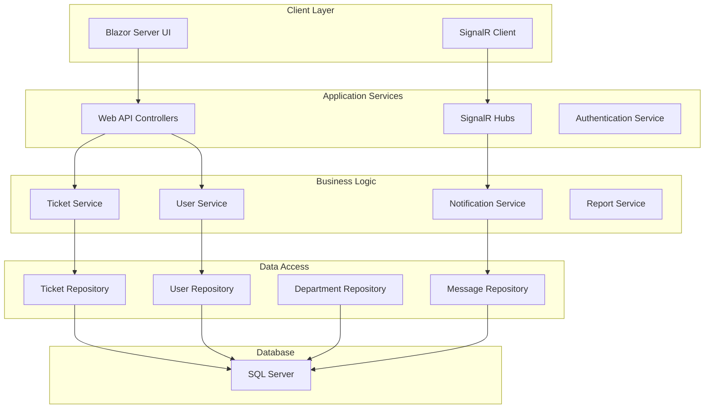
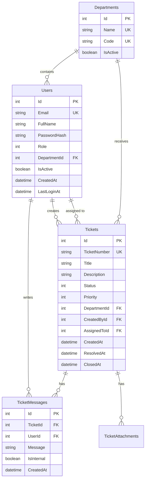

# Software Requirements Specification (SRS)
# Enterprise Ticketing System
## Version 1.0 | December 2024

---

## Table of Contents
1. [Introduction](#1-introduction)
2. [System Architecture](#2-system-architecture)
3. [Functional Requirements](#3-functional-requirements)
4. [Database Design](#4-database-design)
5. [API Specifications](#5-api-specifications)
6. [Domain Layer Design](#6-domain-layer-design)
7. [Data Access Layer Design](#7-data-access-layer-design)
8. [Application Layer Design](#8-application-layer-design)
9. [Security Requirements](#9-security-requirements)
10. [Performance Requirements](#10-performance-requirements)
11. [Testing Requirements](#11-testing-requirements)
12. [Deployment Requirements](#12-deployment-requirements)

---

## 1. Introduction

### 1.1 Purpose
This document specifies the software requirements for the Enterprise Ticketing System, providing detailed technical specifications for development teams to implement a robust, scalable support ticket management solution.

### 1.2 Scope
The system encompasses ticket management, user authentication, real-time notifications, reporting, and live chat capabilities, built using Clean Architecture principles with ASP.NET Core 9 and Blazor Server.

### 1.3 Definitions and Acronyms

| Term | Definition |
|------|------------|
| Clean Architecture | Software design pattern separating concerns into layers |
| Repository Pattern | Data access abstraction without generic implementation |
| DTO | Data Transfer Object |
| JWT | JSON Web Token |
| SignalR | Real-time web functionality library |
| SLA | Service Level Agreement |
| RBAC | Role-Based Access Control |

### 1.4 System Overview
```
┌─────────────────────────────────────────────────┐
│              Presentation Layer                  │
│         (Blazor Server + SignalR)               │
├─────────────────────────────────────────────────┤
│                 API Layer                        │
│         (ASP.NET Core Web API)                  │
├─────────────────────────────────────────────────┤
│            Application Layer                     │
│        (Business Logic & Services)              │
├─────────────────────────────────────────────────┤
│              Domain Layer                        │
│         (Entities & Business Rules)             │
├─────────────────────────────────────────────────┤
│           Data Access Layer                      │
│    (EF Core + Specific Repositories)            │
├─────────────────────────────────────────────────┤
│            Infrastructure                        │
│        (SQL Server Database)                    │
└─────────────────────────────────────────────────┘
```

---

## 2. System Architecture

### 2.1 High-Level Architecture



### 2.2 Technology Stack

| Layer | Technology | Version | Purpose |
|-------|------------|---------|---------|
| Frontend | Blazor Server | .NET 9 | Interactive UI |
| API | ASP.NET Core | .NET 9 | RESTful services |
| Real-time | SignalR | .NET 9 | WebSocket communication |
| ORM | Entity Framework Core | 9.0 | Database access |
| Database | SQL Server | 2019+ | Data persistence |
| Authentication | JWT Bearer | - | Token-based auth |
| Validation | FluentValidation | 11.9 | Input validation |
| Mapping | AutoMapper | 12.0 | Object mapping |
| Hashing | BCrypt.Net | 4.0 | Password security |

### 2.3 Project Structure

```
EnterpriseTicketing/
├── EnterpriseTicketing.Domain/
│   ├── Entities/
│   │   ├── Base/
│   │   │   └── BaseEntity.cs
│   │   ├── User.cs
│   │   ├── Ticket.cs
│   │   ├── Department.cs
│   │   ├── TicketMessage.cs
│   │   └── TicketAttachment.cs
│   ├── Enums/
│   │   └── Enums.cs
│   ├── Interfaces/
│   │   └── IEntity.cs
│   └── ValueObjects/
│       └── Email.cs
│
├── EnterpriseTicketing.Data/
│   ├── Context/
│   │   └── ApplicationDbContext.cs
│   ├── Configurations/
│   │   ├── UserConfiguration.cs
│   │   ├── TicketConfiguration.cs
│   │   └── DepartmentConfiguration.cs
│   ├── Repositories/
│   │   ├── UserRepository.cs
│   │   ├── TicketRepository.cs
│   │   ├── DepartmentRepository.cs
│   │   └── MessageRepository.cs
│   ├── Migrations/
│   └── Seed/
│       └── DatabaseSeeder.cs
│
├── EnterpriseTicketing.Application/
│   ├── DTOs/
│   │   ├── User/
│   │   ├── Ticket/
│   │   └── Common/
│   ├── IServices/
│   │   ├── IUserService.cs
│   │   ├── ITicketService.cs
│   │   └── INotificationService.cs
│   ├── Services/
│   │   ├── UserService.cs
│   │   ├── TicketService.cs
│   │   └── NotificationService.cs
│   ├── Validators/
│   │   ├── UserValidator.cs
│   │   └── TicketValidator.cs
│   └── Mappings/
│       └── MappingProfile.cs
│
├── EnterpriseTicketing.API/
│   ├── Controllers/
│   │   ├── Base/
│   │   │   └── ApiControllerBase.cs
│   │   ├── AuthController.cs
│   │   ├── TicketsController.cs
│   │   └── UsersController.cs
│   ├── Hubs/
│   │   └── TicketHub.cs
│   ├── Middleware/
│   │   ├── ExceptionMiddleware.cs
│   │   └── AuthenticationMiddleware.cs
│   └── Program.cs
│
└── EnterpriseTicketing.Blazor/
    ├── Pages/
    │   ├── Auth/
    │   ├── Tickets/
    │   └── Dashboard/
    ├── Shared/
    │   └── Components/
    └── Services/
        └── ApiClient.cs
```

---

## 3. Functional Requirements

### 3.1 User Authentication Module (FR-AUTH)

#### FR-AUTH-001: User Registration
```csharp
// Request Model
public class RegisterRequest
{
    public string Email { get; set; }      // Required, Valid email format
    public string FullName { get; set; }   // Required, 3-100 characters
    public string Password { get; set; }   // Required, Min 8 chars, 1 upper, 1 lower, 1 digit, 1 special
    public int DepartmentId { get; set; }  // Required, Valid department
}

// Business Logic
1. Validate email uniqueness
2. Validate password complexity
3. Hash password using BCrypt
4. Create user with default role (User)
5. Send verification email
6. Return success/failure result

// Response Model
public class RegisterResponse
{
    public bool Success { get; set; }
    public string Message { get; set; }
    public string UserId { get; set; }
}
```

#### FR-AUTH-002: User Login
```csharp
// Request Model
public class LoginRequest
{
    public string Email { get; set; }
    public string Password { get; set; }
    public bool RememberMe { get; set; }
}

// Business Logic
1. Validate user exists and is active
2. Verify password hash
3. Generate JWT token (24h or 7d if RememberMe)
4. Log login attempt
5. Return token and user info

// Response Model
public class LoginResponse
{
    public bool Success { get; set; }
    public string Token { get; set; }
    public string RefreshToken { get; set; }
    public DateTime ExpiresAt { get; set; }
    public UserDto User { get; set; }
}
```

#### FR-AUTH-003: Password Reset
```csharp
// Request Models
public class PasswordResetRequest
{
    public string Email { get; set; }
}

public class PasswordResetConfirmRequest
{
    public string Token { get; set; }
    public string NewPassword { get; set; }
}

// Business Logic
1. Generate secure reset token
2. Store token with 1-hour expiry
3. Send reset email
4. Validate token on reset
5. Update password hash
6. Invalidate all existing sessions
```

### 3.2 Ticket Management Module (FR-TICKET)

#### FR-TICKET-001: Create Ticket
```csharp
// Request Model
public class CreateTicketRequest
{
    public string Title { get; set; }           // 5-100 characters
    public string Description { get; set; }     // 20-2000 characters
    public int DepartmentId { get; set; }
    public Priority Priority { get; set; }
    public List<IFormFile> Attachments { get; set; }  // Max 3 files, 5MB each
}

// Business Logic
1. Validate input data
2. Generate ticket number (YYYY-NNNNNN)
3. Set initial status (New)
4. Calculate SLA deadline based on priority
5. Save attachments to storage
6. Create ticket record
7. Send notifications
8. Return ticket details

// Ticket Number Generation
string GenerateTicketNumber()
{
    var year = DateTime.Now.Year;
    var sequence = GetNextSequence(year);
    return $"{year}-{sequence:D6}";
}
```

#### FR-TICKET-002: Update Ticket Status
```csharp
// State Transitions
New → InProgress (Agent assigns to self)
InProgress → Pending (Awaiting user input)
Pending → InProgress (User responds)
InProgress → Resolved (Agent resolves)
Resolved → Closed (Auto after 72h or user confirms)
Resolved → Reopened (User reopens within 7 days)
Any → Cancelled (Creator or Admin)

// Validation Rules
public bool CanTransition(TicketStatus from, TicketStatus to, UserRole role)
{
    return (from, to, role) switch
    {
        (TicketStatus.New, TicketStatus.InProgress, UserRole.Agent) => true,
        (TicketStatus.InProgress, TicketStatus.Resolved, UserRole.Agent) => true,
        (TicketStatus.Resolved, TicketStatus.Closed, _) => true,
        (_, TicketStatus.Cancelled, UserRole.Admin) => true,
        _ => false
    };
}
```

#### FR-TICKET-003: Assign Ticket
```csharp
// Assignment Logic
public async Task<AssignmentResult> AssignTicket(int ticketId, int? agentId)
{
    if (agentId.HasValue)
    {
        // Manual assignment
        return await ManualAssign(ticketId, agentId.Value);
    }
    else
    {
        // Auto-assignment algorithm
        var availableAgents = await GetAvailableAgents(ticket.DepartmentId);
        var selectedAgent = SelectBestAgent(availableAgents, ticket);
        return await ManualAssign(ticketId, selectedAgent.Id);
    }
}

// Agent Selection Algorithm
Agent SelectBestAgent(List<Agent> agents, Ticket ticket)
{
    return agents
        .Where(a => a.IsOnline && a.CurrentLoad < a.MaxCapacity)
        .OrderBy(a => a.CurrentLoad)
        .ThenBy(a => a.LastAssignmentTime)
        .FirstOrDefault();
}
```

### 3.3 Messaging Module (FR-MSG)

#### FR-MSG-001: Add Message to Ticket
```csharp
public class AddMessageRequest
{
    public int TicketId { get; set; }
    public string Message { get; set; }      // 1-2000 characters
    public bool IsInternal { get; set; }     // Agent only
    public List<IFormFile> Attachments { get; set; }
}

// Business Logic
1. Validate user has access to ticket
2. Sanitize message content (XSS prevention)
3. Save message with timestamp
4. Update ticket modified date
5. Send notifications
6. Broadcast via SignalR
```
#### FR-MSG-003: Browser Push Notifications
```csharp
// Notification Throttling Logic
public class NotificationThrottleService
{
    private readonly Dictionary<int, Queue<Notification>> _userNotifications = new();
    private readonly Timer _throttleTimer;
    
    public async Task SendNotification(int userId, Notification notification)
    {
        if (!_userNotifications.ContainsKey(userId))
            _userNotifications[userId] = new Queue<Notification>();
        
        _userNotifications[userId].Enqueue(notification);
        
        // If more than 10 notifications in queue
        if (_userNotifications[userId].Count >= 10)
        {
            await SendBatchNotification(userId);
        }
        else if (_userNotifications[userId].Count == 1)
        {
            // Start 1-minute timer for batching
            StartThrottleTimer(userId);
        }
    }
    
    private async Task SendBatchNotification(int userId)
    {
        var count = _userNotifications[userId].Count;
        var message = count > 10 
            ? $"You have {count} new notifications" 
            : string.Join(", ", _userNotifications[userId].Select(n => n.Title));
            
        await BrowserNotificationService.Push(new BatchNotification
        {
            Title = "Ticketing System",
            Body = message,
            Icon = "/icons/notification.png",
            Badge = count.ToString()
        });
        
        _userNotifications[userId].Clear();
    }
}
```

### FR-NOTIF-002: Service Worker Registration
```javascript
// wwwroot/service-worker.js
self.addEventListener('install', event => {
    console.log('Service Worker installing.');
    self.skipWaiting();
});

self.addEventListener('activate', event => {
    console.log('Service Worker activated.');
    event.waitUntil(clients.claim());
});

self.addEventListener('push', event => {
    const options = {
        body: event.data ? event.data.text() : 'New notification',
        icon: '/icons/icon-192.png',
        badge: '/icons/badge-72.png',
        vibrate: [200, 100, 200],
        data: {
            dateOfArrival: Date.now(),
            primaryKey: 1
        },
        actions: [
            {
                action: 'view',
                title: 'مشاهده',
                icon: '/icons/view.png'
            },
            {
                action: 'dismiss',
                title: 'بستن',
                icon: '/icons/close.png'
            }
        ]
    };
    
    event.waitUntil(
        self.registration.showNotification('Enterprise Ticketing', options)
    );
});

self.addEventListener('notificationclick', event => {
    event.notification.close();
    
    if (event.action === 'view') {
        clients.openWindow('/tickets/' + event.notification.data.primaryKey);
    }
});```
### 3.4 Real-time Communication (FR-RT)

#### FR-RT-001: SignalR Hub Implementation
```csharp
public interface ITicketHub
{
    // Server to Client
    Task TicketCreated(TicketDto ticket);
    Task TicketUpdated(TicketUpdateDto update);
    Task NewMessage(MessageDto message);
    Task AgentStatusChanged(AgentStatusDto status);
    
    // Client to Server
    Task JoinTicketGroup(int ticketId);
    Task LeaveTicketGroup(int ticketId);
    Task SendTypingIndicator(int ticketId);
}
```

### 3.5 Comprehensive Reporting Module (FR-REPORT)
#### FR-REPORT-001: Multi-Dimensional Analytics Dashboard
```csharp
public class ComprehensiveReportMetrics
{
    // User Analytics
    public class UserAnalytics
    {
        public int TotalTicketsCreated { get; set; }
        public double AverageResolutionTime { get; set; }
        public Dictionary<Priority, int> TicketsByPriority { get; set; }
        public Dictionary<TicketStatus, int> TicketsByStatus { get; set; }
        public List<TicketTrend> WeeklyTrends { get; set; }
        public double SatisfactionScore { get; set; }
    }
    
    // Agent Performance Analytics
    public class AgentAnalytics
    {
        public int TicketsHandled { get; set; }
        public double AverageFirstResponseTime { get; set; }
        public double AverageResolutionTime { get; set; }
        public double CustomerSatisfactionRating { get; set; }
        public int TicketsEscalated { get; set; }
        public int TicketsResolvedFirstContact { get; set; }
        public Dictionary<Hour, int> ProductivityByHour { get; set; }
    }
    
    // Department Analytics
    public class DepartmentAnalytics
    {
        public int TotalTicketVolume { get; set; }
        public double SlaComplianceRate { get; set; }
        public Dictionary<Category, int> TicketsByCategory { get; set; }
        public List<AgentWorkload> TeamWorkloadDistribution { get; set; }
        public double AverageQueueTime { get; set; }
        public List<PeakHour> PeakHours { get; set; }
    }
    
    // System Health Metrics
    public class SystemAnalytics
    {
        public double AverageApiResponseTime { get; set; }
        public int ActiveUsers { get; set; }
        public int ConcurrentSessions { get; set; }
        public double ErrorRate { get; set; }
        public long DatabaseSize { get; set; }
        public Dictionary<string, int> ApiCallFrequency { get; set; }
        public List<SystemAlert> PerformanceAlerts { get; set; }
    }
    
    // Business Intelligence
    public class BusinessIntelligence
    {
        public decimal CostPerTicket { get; set; }
        public double FirstContactResolutionRate { get; set; }
        public double TicketBacklogGrowthRate { get; set; }
        public Dictionary<Department, double> DepartmentEfficiency { get; set; }
        public List<TrendPrediction> ForecastedVolume { get; set; }
        public ROIMetrics ReturnOnInvestment { get; set; }
    }
}
FR-REPORT-002: Real-time Analytics Engine
csharppublic interface IAnalyticsService
{
    // Real-time Metrics
    Task<LiveMetrics> GetLiveMetricsAsync();
    Task<Queue<Ticket>> GetCurrentQueueAsync(int? departmentId);
    Task<List<AgentStatus>> GetAgentStatusesAsync();
    
    // Historical Reports
    Task<Report> GenerateCustomReportAsync(ReportCriteria criteria);
    Task<byte[]> ExportReportAsync(int reportId, ExportFormat format);
    Task ScheduleReportAsync(ReportSchedule schedule);
    
    // Predictive Analytics
    Task<VolumeForcast> PredictTicketVolumeAsync(DateTime startDate, int days);
    Task<List<User>> IdentifyHighRiskUsersAsync(); // Users likely to escalate
    Task<List<string>> SuggestKnowledgeBaseArticlesAsync(); // Based on common issues
}

// Report Types
public enum ReportType
{
    ExecutiveSummary,
    AgentPerformance,
    DepartmentAnalysis,
    SLACompliance,
    CustomerSatisfaction,
    TrendAnalysis,
    CostAnalysis,
    QualityAssurance,
    SystemHealth,
    Custom
}```

#### FR-REPORT-001: Dashboard Metrics
```csharp
public class DashboardMetrics
{
    // User Dashboard
    public int OpenTickets { get; set; }
    public int ResolvedThisWeek { get; set; }
    public double AverageResolutionTime { get; set; }
    
    // Agent Dashboard
    public int AssignedTickets { get; set; }
    public int PendingTickets { get; set; }
    public int OverdueTickets { get; set; }
    public double ResponseTimeAverage { get; set; }
    
    // Manager Dashboard
    public Dictionary<TicketStatus, int> StatusDistribution { get; set; }
    public List<AgentPerformance> TeamPerformance { get; set; }
    public double SlaComplianceRate { get; set; }
}
```
### 3.7 Localization System (FR-LOCAL)
#### FR-LOCAL-001: Multi-Language Support
```csharp
public interface ILocalizationService
{
    string CurrentCulture { get; }
    Task ChangeCultureAsync(string culture);
    string GetString(string key);
    string GetString(string key, params object[] args);
    Direction GetDirection();
}

public enum Direction
{
    LTR,  // Left to Right (English)
    RTL   // Right to Left (Persian)
}

public class LocalizationService : ILocalizationService
{
    private readonly IStringLocalizer<SharedResource> _localizer;
    private readonly ILocalStorageService _localStorage;
    private string _currentCulture = "en-US";
    
    public string CurrentCulture => _currentCulture;
    
    public async Task ChangeCultureAsync(string culture)
    {
        _currentCulture = culture;
        var cultureInfo = new CultureInfo(culture);
        
        CultureInfo.DefaultThreadCurrentCulture = cultureInfo;
        CultureInfo.DefaultThreadCurrentUICulture = cultureInfo;
        
        // Persian calendar setup
        if (culture == "fa-IR")
        {
            cultureInfo.DateTimeFormat.Calendar = new PersianCalendar();
        }
        
        await _localStorage.SetItemAsync("culture", culture);
        
        // Notify UI to refresh
        OnCultureChanged?.Invoke(culture);
    }
    
    public Direction GetDirection() => _currentCulture == "fa-IR" ? Direction.RTL : Direction.LTR;
    
    public event Action<string>? OnCultureChanged;
}```
### FR-LOCAL-002: Resource Files Structure
```txt
Resources/
├── SharedResource.resx (English - default)
├── SharedResource.fa.resx (Persian)
├── Pages/
│   ├── Tickets/
│   │   ├── TicketList.resx
│   │   └── TicketList.fa.resx
│   └── Dashboard/
│       ├── Dashboard.resx
│       └── Dashboard.fa.resx
```


### 3.8 Theme Management System (FR-THEME)
#### FR-THEME-001: Dark/Light Mode Implementation
```csharp
public interface IThemeService
{
    MudTheme CurrentTheme { get; }
    bool IsDarkMode { get; }
    Task ToggleThemeAsync();
    Task SetThemeAsync(bool isDarkMode);
    event Action? OnThemeChanged;
}

public class ThemeService : IThemeService
{
    private readonly ILocalStorageService _localStorage;
    private bool _isDarkMode = true; // Default to dark mode
    
    public bool IsDarkMode => _isDarkMode;
    
    public MudTheme CurrentTheme => _isDarkMode ? DarkTheme : LightTheme;
    
    public event Action? OnThemeChanged;
    
    private static readonly MudTheme DarkTheme = new()
    {
        Palette = new PaletteDark
        {
            Primary = "#1976D2",
            Secondary = "#424242",
            Background = "#121212",
            Surface = "#1E1E1E",
            DrawerBackground = "#1E1E1E",
            AppbarBackground = "#1976D2",
            AppbarText = Colors.White,
            TextPrimary = Colors.White,
            TextSecondary = "rgba(255,255,255, 0.70)",
            ActionDefault = "#ADADB1",
            ActionDisabled = "rgba(255,255,255, 0.26)",
            ActionDisabledBackground = "rgba(255,255,255, 0.12)",
            DrawerText = "rgba(255,255,255, 0.70)",
            DrawerIcon = "rgba(255,255,255, 0.70)"
        },
        Typography = new Typography
        {
            Default = new Default
            {
                FontFamily = new[] { "Vazirmatn", "Roboto", "Helvetica", "Arial", "sans-serif" }
            }
        }
    };
    
    private static readonly MudTheme LightTheme = new()
    {
        Palette = new PaletteLight
        {
            Primary = "#1976D2",
            Secondary = "#424242",
            Background = "#FFFFFF",
            Surface = "#F5F5F5",
            DrawerBackground = "#FFFFFF",
            AppbarBackground = "#1976D2",
            AppbarText = Colors.White,
            TextPrimary = "rgba(0,0,0, 0.87)",
            TextSecondary = "rgba(0,0,0, 0.54)",
            ActionDefault = "#656565",
            ActionDisabled = "rgba(0,0,0, 0.26)",
            ActionDisabledBackground = "rgba(0,0,0, 0.12)"
        }
    };
    
    public async Task SetThemeAsync(bool isDarkMode)
    {
        _isDarkMode = isDarkMode;
        await _localStorage.SetItemAsync("theme", isDarkMode ? "dark" : "light");
        OnThemeChanged?.Invoke();
    }
}
```

### 3.9 Comprehensive Analytics Module (FR-ANALYTICS)
#### FR-ANALYTICS-001: Multi-Dimensional Reporting Engine
```csharp
public interface IAnalyticsService
{
    // Real-time Analytics
    Task<DashboardMetrics> GetRealTimeMetricsAsync();
    Task<List<LiveTicket>> GetLiveTicketStreamAsync();
    Task<AgentActivityStatus> GetAgentActivityAsync();
    
    // Historical Analytics
    Task<TicketAnalytics> GetTicketAnalyticsAsync(AnalyticsFilter filter);
    Task<AgentPerformanceReport> GetAgentPerformanceAsync(int agentId, DateRange range);
    Task<DepartmentReport> GetDepartmentReportAsync(int departmentId, DateRange range);
    
    // Predictive Analytics
    Task<VolumeForcast> ForecastTicketVolumeAsync(ForecastParameters parameters);
    Task<List<TrendAnalysis>> AnalyzeTrendsAsync(TrendParameters parameters);
    
    // Export Capabilities
    Task<byte[]> ExportReportAsync(ReportType type, ExportFormat format, object parameters);
}

public class DashboardMetrics
{
    // Overall System Metrics
    public SystemOverview System { get; set; }
    
    // Ticket Metrics
    public TicketMetrics Tickets { get; set; }
    
    // User Activity
    public UserActivityMetrics UserActivity { get; set; }
    
    // Performance Indicators
    public PerformanceIndicators Performance { get; set; }
}

public class TicketAnalytics
{
    // Volume Analysis
    public int TotalTickets { get; set; }
    public Dictionary<DateTime, int> TicketsByDate { get; set; }
    public Dictionary<Hour, int> TicketsByHour { get; set; }
    public Dictionary<DayOfWeek, int> TicketsByDayOfWeek { get; set; }
    
    // Status Distribution
    public Dictionary<TicketStatus, int> StatusDistribution { get; set; }
    public Dictionary<Priority, int> PriorityDistribution { get; set; }
    
    // Category Analysis
    public Dictionary<string, int> TopCategories { get; set; }
    public Dictionary<string, double> CategoryResolutionTime { get; set; }
    
    // SLA Compliance
    public double SlaComplianceRate { get; set; }
    public List<SlaViolation> SlaViolations { get; set; }
    
    // Resolution Metrics
    public double AverageResolutionTime { get; set; }
    public double FirstContactResolutionRate { get; set; }
    public double ReopenRate { get; set; }
    
    // Customer Satisfaction
    public double AverageSatisfactionScore { get; set; }
    public Dictionary<int, int> SatisfactionDistribution { get; set; }
}```
#### FR-ANALYTICS-002: Report Builder
```csharp
public class ReportBuilder
{
    private readonly IAnalyticsService _analyticsService;
    private readonly IReportTemplateService _templateService;
    
    public async Task<Report> BuildCustomReportAsync(ReportDefinition definition)
    {
        var report = new Report
        {
            Title = definition.Title,
            GeneratedAt = DateTime.UtcNow,
            Parameters = definition.Parameters
        };
        
        // Build sections based on definition
        foreach (var section in definition.Sections)
        {
            var sectionData = section.Type switch
            {
                SectionType.TicketVolume => await GetTicketVolumeData(section.Parameters),
                SectionType.AgentPerformance => await GetAgentPerformanceData(section.Parameters),
                SectionType.DepartmentAnalysis => await GetDepartmentData(section.Parameters),
                SectionType.SlaCompliance => await GetSlaData(section.Parameters),
                SectionType.CustomerSatisfaction => await GetSatisfactionData(section.Parameters),
                SectionType.TrendAnalysis => await GetTrendData(section.Parameters),
                _ => null
            };
            
            report.Sections.Add(new ReportSection
            {
                Type = section.Type,
                Data = sectionData,
                Charts = GenerateCharts(sectionData, section.ChartTypes)
            });
        }
        
        return report;
    }
}
---

## 4. Database Design

### 4.1 Entity Relationship Diagram



### 4.2 Database Tables

#### 4.2.1 Users Table
```sql
CREATE TABLE Users (
    Id INT IDENTITY(1,1) PRIMARY KEY,
    Email NVARCHAR(100) NOT NULL UNIQUE,
    FullName NVARCHAR(100) NOT NULL,
    PasswordHash NVARCHAR(255) NOT NULL,
    Role INT NOT NULL DEFAULT 0,
    DepartmentId INT NULL,
    IsActive BIT NOT NULL DEFAULT 1,
    LastLoginAt DATETIME2 NULL,
    LastLoginIP NVARCHAR(45) NULL,
    FailedLoginAttempts INT NOT NULL DEFAULT 0,
    LockedUntil DATETIME2 NULL,
    CreatedAt DATETIME2 NOT NULL DEFAULT GETUTCDATE(),
    CreatedBy NVARCHAR(100) NOT NULL,
    ModifiedAt DATETIME2 NULL,
    ModifiedBy NVARCHAR(100) NULL,
    
    CONSTRAINT FK_Users_Department FOREIGN KEY (DepartmentId) 
        REFERENCES Departments(Id),
    INDEX IX_Users_Email (Email),
    INDEX IX_Users_Department (DepartmentId)
);
```

#### 4.2.2 Tickets Table
```sql
CREATE TABLE Tickets (
    Id INT IDENTITY(1,1) PRIMARY KEY,
    TicketNumber AS (CONCAT(YEAR(CreatedAt), '-', RIGHT('000000' + CAST(Id AS VARCHAR(6)), 6))) PERSISTED UNIQUE,
    Title NVARCHAR(100) NOT NULL,
    Description NVARCHAR(2000) NOT NULL,
    Status INT NOT NULL DEFAULT 0,
    Priority INT NOT NULL DEFAULT 1,
    DepartmentId INT NOT NULL,
    CreatedById INT NOT NULL,
    AssignedToId INT NULL,
    SlaDeadline DATETIME2 NOT NULL,
    ResolvedAt DATETIME2 NULL,
    ResolutionNotes NVARCHAR(1000) NULL,
    ClosedAt DATETIME2 NULL,
    CancelledAt DATETIME2 NULL,
    CancellationReason NVARCHAR(500) NULL,
    CreatedAt DATETIME2 NOT NULL DEFAULT GETUTCDATE(),
    CreatedBy NVARCHAR(100) NOT NULL,
    ModifiedAt DATETIME2 NULL,
    ModifiedBy NVARCHAR(100) NULL,
    
    CONSTRAINT FK_Tickets_Department FOREIGN KEY (DepartmentId) 
        REFERENCES Departments(Id),
    CONSTRAINT FK_Tickets_CreatedBy FOREIGN KEY (CreatedById) 
        REFERENCES Users(Id),
    CONSTRAINT FK_Tickets_AssignedTo FOREIGN KEY (AssignedToId) 
        REFERENCES Users(Id),
    
    INDEX IX_Tickets_Status (Status),
    INDEX IX_Tickets_Priority (Priority),
    INDEX IX_Tickets_Department (DepartmentId),
    INDEX IX_Tickets_AssignedTo (AssignedToId),
    INDEX IX_Tickets_CreatedBy (CreatedById),
    INDEX IX_Tickets_SLA (SlaDeadline)
);
```

#### 4.2.3 TicketMessages Table
```sql
CREATE TABLE TicketMessages (
    Id INT IDENTITY(1,1) PRIMARY KEY,
    TicketId INT NOT NULL,
    UserId INT NOT NULL,
    Message NVARCHAR(2000) NOT NULL,
    IsInternal BIT NOT NULL DEFAULT 0,
    CreatedAt DATETIME2 NOT NULL DEFAULT GETUTCDATE(),
    CreatedBy NVARCHAR(100) NOT NULL,
    
    CONSTRAINT FK_Messages_Ticket FOREIGN KEY (TicketId) 
        REFERENCES Tickets(Id) ON DELETE CASCADE,
    CONSTRAINT FK_Messages_User FOREIGN KEY (UserId) 
        REFERENCES Users(Id),
    
    INDEX IX_Messages_Ticket (TicketId),
    INDEX IX_Messages_User (UserId)
);
```

### 4.3 Stored Procedures

#### 4.3.1 GetTicketMetrics
```sql
CREATE PROCEDURE GetTicketMetrics
    @DepartmentId INT = NULL,
    @StartDate DATETIME2,
    @EndDate DATETIME2
AS
BEGIN
    SELECT 
        COUNT(*) as TotalTickets,
        AVG(DATEDIFF(HOUR, CreatedAt, ResolvedAt)) as AvgResolutionHours,
        SUM(CASE WHEN Status = 2 THEN 1 ELSE 0 END) as ResolvedCount,
        SUM(CASE WHEN SlaDeadline < GETUTCDATE() AND Status < 2 THEN 1 ELSE 0 END) as OverdueCount
    FROM Tickets
    WHERE CreatedAt BETWEEN @StartDate AND @EndDate
        AND (@DepartmentId IS NULL OR DepartmentId = @DepartmentId);
END
```

---

## 5. API Specifications

### 5.1 API Design Principles

- RESTful design patterns
- Consistent naming conventions
- Versioning strategy (/api/v1/)
- Standard HTTP status codes
- Pagination for list endpoints
- Request/Response validation

### 5.2 Authentication Endpoints

#### POST /api/v1/auth/register
```http
Request:
POST /api/v1/auth/register
Content-Type: application/json

{
    "email": "user@company.com",
    "fullName": "John Doe",
    "password": "SecureP@ss123",
    "departmentId": 1
}

Response (201 Created):
{
    "success": true,
    "message": "Registration successful",
    "data": {
        "userId": 123,
        "email": "user@company.com"
    }
}
```

#### POST /api/v1/auth/login
```http
Request:
POST /api/v1/auth/login
Content-Type: application/json

{
    "email": "user@company.com",
    "password": "SecureP@ss123",
    "rememberMe": false
}

Response (200 OK):
{
    "success": true,
    "data": {
        "token": "eyJhbGciOiJIUzI1NiIs...",
        "refreshToken": "d5f6g7h8...",
        "expiresAt": "2024-12-02T10:00:00Z",
        "user": {
            "id": 123,
            "email": "user@company.com",
            "fullName": "John Doe",
            "role": "User"
        }
    }
}
```

### 5.3 Ticket Endpoints

#### GET /api/v1/tickets
```http
Request:
GET /api/v1/tickets?status=0&priority=2&page=1&pageSize=20
Authorization: Bearer {token}

Response (200 OK):
{
    "success": true,
    "data": {
        "items": [...],
        "totalCount": 150,
        "page": 1,
        "pageSize": 20,
        "totalPages": 8
    }
}
```

#### POST /api/v1/tickets
```http
Request:
POST /api/v1/tickets
Authorization: Bearer {token}
Content-Type: multipart/form-data

title: System not working
description: Cannot login to the system...
departmentId: 2
priority: 2
attachments: [file1.pdf, file2.jpg]

Response (201 Created):
{
    "success": true,
    "data": {
        "id": 456,
        "ticketNumber": "2024-000456",
        "title": "System not working",
        "status": "New",
        "createdAt": "2024-12-01T09:30:00Z"
    }
}
```

### 5.4 Error Responses

```json
{
    "success": false,
    "error": {
        "code": "VALIDATION_ERROR",
        "message": "Validation failed",
        "details": [
            {
                "field": "email",
                "message": "Email is required"
            }
        ]
    }
}
```

---

## 6. Domain Layer Design

### 6.1 Base Entity

```csharp
namespace EnterpriseTicketing.Domain.Entities.Base
{
    public abstract class BaseEntity
    {
        public int Id { get; set; }
        public DateTime CreatedAt { get; set; }
        public string CreatedBy { get; set; } = string.Empty;
        public DateTime? ModifiedAt { get; set; }
        public string? ModifiedBy { get; set; }
    }
    
    public abstract class AuditableEntity : BaseEntity
    {
        public byte[] RowVersion { get; set; } // Optimistic concurrency
    }
}
```

### 6.2 Core Entities

```csharp
namespace EnterpriseTicketing.Domain.Entities
{
    public class User : AuditableEntity
    {
        public string Email { get; set; }
        public string FullName { get; set; }
        public string PasswordHash { get; set; }
        public UserRole Role { get; set; }
        public int? DepartmentId { get; set; }
        public bool IsActive { get; set; }
        public DateTime? LastLoginAt { get; set; }
        public string? LastLoginIP { get; set; }
        public int FailedLoginAttempts { get; set; }
        public DateTime? LockedUntil { get; set; }
        
        // Navigation Properties
        public virtual Department? Department { get; set; }
        public virtual ICollection<Ticket> CreatedTickets { get; set; }
        public virtual ICollection<Ticket> AssignedTickets { get; set; }
        public virtual ICollection<TicketMessage> Messages { get; set; }
    }
    
    public class Ticket : AuditableEntity
    {
        public string TicketNumber { get; set; }
        public string Title { get; set; }
        public string Description { get; set; }
        public TicketStatus Status { get; set; }
        public Priority Priority { get; set; }
        public int DepartmentId { get; set; }
        public int CreatedById { get; set; }
        public int? AssignedToId { get; set; }
        public DateTime SlaDeadline { get; set; }
        public DateTime? ResolvedAt { get; set; }
        public string? ResolutionNotes { get; set; }
        public DateTime? ClosedAt { get; set; }
        public DateTime? CancelledAt { get; set; }
        public string? CancellationReason { get; set; }
        
        // Navigation Properties
        public virtual Department Department { get; set; }
        public virtual User CreatedBy { get; set; }
        public virtual User? AssignedTo { get; set; }
        public virtual ICollection<TicketMessage> Messages { get; set; }
        public virtual ICollection<TicketAttachment> Attachments { get; set; }
    }
}
```

### 6.3 Enumerations

```csharp
namespace EnterpriseTicketing.Domain.Enums
{
    public enum UserRole
    {
        User = 0,
        Agent = 1,
        DepartmentManager = 2,
        Admin = 3
    }
    
    public enum TicketStatus
    {
        New = 0,
        InProgress = 1,
        Pending = 2,
        Resolved = 3,
        Closed = 4,
        Cancelled = 5,
        Reopened = 6
    }
    
    public enum Priority
    {
        Low = 0,
        Normal = 1,
        High = 2,
        Critical = 3
    }
}
```

---

## 7. Data Access Layer Design

### 7.1 Repository Interfaces

```csharp
namespace EnterpriseTicketing.Data.Repositories.Interfaces
{
    public interface IUserRepository
    {
        Task<User?> GetByIdAsync(int id);
        Task<User?> GetByEmailAsync(string email);
        Task<IEnumerable<User>> GetAllAsync();
        Task<IEnumerable<User>> GetByDepartmentAsync(int departmentId);
        Task<IEnumerable<User>> GetAgentsAsync();
        Task<User> CreateAsync(User user);
        Task UpdateAsync(User user);
        Task DeleteAsync(int id);
        Task<bool> EmailExistsAsync(string email);
        Task<int> GetActiveUsersCountAsync();
    }
    
    public interface ITicketRepository
    {
        Task<Ticket?> GetByIdAsync(int id);
        Task<Ticket?> GetByNumberAsync(string ticketNumber);
        Task<IEnumerable<Ticket>> GetAllAsync();
        Task<IEnumerable<Ticket>> GetByUserAsync(int userId);
        Task<IEnumerable<Ticket>> GetByAgentAsync(int agentId);
        Task<IEnumerable<Ticket>> GetByDepartmentAsync(int departmentId);
        Task<IEnumerable<Ticket>> GetOverdueTicketsAsync();
        Task<Ticket> CreateAsync(Ticket ticket);
        Task UpdateAsync(Ticket ticket);
        Task UpdateStatusAsync(int ticketId, TicketStatus status);
        Task AssignAsync(int ticketId, int agentId);
        Task<TicketMetrics> GetMetricsAsync(int? departmentId, DateTime startDate, DateTime endDate);
        Task<int> GetNextSequenceNumberAsync(int year);
    }
}
```

### 7.2 Repository Implementations

```csharp
namespace EnterpriseTicketing.Data.Repositories
{
    public class UserRepository : IUserRepository
    {
        private readonly ApplicationDbContext _context;
        
        public UserRepository(ApplicationDbContext context)
        {
            _context = context;
        }
        
        public async Task<User?> GetByIdAsync(int id)
        {
            return await _context.Users
                .Include(u => u.Department)
                .FirstOrDefaultAsync(u => u.Id == id);
        }
        
        public async Task<User?> GetByEmailAsync(string email)
        {
            return await _context.Users
                .Include(u => u.Department)
                .FirstOrDefaultAsync(u => u.Email == email);
        }
        
        public async Task<IEnumerable<User>> GetAgentsAsync()
        {
            return await _context.Users
                .Where(u => u.Role == UserRole.Agent && u.IsActive)
                .Include(u => u.Department)
                .ToListAsync();
        }
        
        public async Task<User> CreateAsync(User user)
        {
            _context.Users.Add(user);
            await _context.SaveChangesAsync();
            return user;
        }
        
        public async Task UpdateAsync(User user)
        {
            _context.Users.Update(user);
            await _context.SaveChangesAsync();
        }
        
        public async Task<bool> EmailExistsAsync(string email)
        {
            return await _context.Users.AnyAsync(u => u.Email == email);
        }
    }
    
    public class TicketRepository : ITicketRepository
    {
        private readonly ApplicationDbContext _context;
        
        public TicketRepository(ApplicationDbContext context)
        {
            _context = context;
        }
        
        public async Task<Ticket?> GetByIdAsync(int id)
        {
            return await _context.Tickets
                .Include(t => t.Department)
                .Include(t => t.CreatedBy)
                .Include(t => t.AssignedTo)
                .Include(t => t.Messages)
                    .ThenInclude(m => m.User)
                .Include(t => t.Attachments)
                .FirstOrDefaultAsync(t => t.Id == id);
        }
        
        public async Task<IEnumerable<Ticket>> GetByUserAsync(int userId)
        {
            return await _context.Tickets
                .Where(t => t.CreatedById == userId)
                .Include(t => t.Department)
                .OrderByDescending(t => t.CreatedAt)
                .ToListAsync();
        }
        
        public async Task<IEnumerable<Ticket>> GetOverdueTicketsAsync()
        {
            return await _context.Tickets
                .Where(t => t.SlaDeadline < DateTime.UtcNow 
                    && t.Status != TicketStatus.Closed 
                    && t.Status != TicketStatus.Resolved)
                .Include(t => t.Department)
                .Include(t => t.AssignedTo)
                .ToListAsync();
        }
        
        public async Task UpdateStatusAsync(int ticketId, TicketStatus status)
        {
            var ticket = await _context.Tickets.FindAsync(ticketId);
            if (ticket != null)
            {
                ticket.Status = status;
                ticket.ModifiedAt = DateTime.UtcNow;
                
                if (status == TicketStatus.Resolved)
                    ticket.ResolvedAt = DateTime.UtcNow;
                else if (status == TicketStatus.Closed)
                    ticket.ClosedAt = DateTime.UtcNow;
                    
                await _context.SaveChangesAsync();
            }
        }
        
        public async Task<int> GetNextSequenceNumberAsync(int year)
        {
            var lastTicket = await _context.Tickets
                .Where(t => t.CreatedAt.Year == year)
                .OrderByDescending(t => t.Id)
                .FirstOrDefaultAsync();
                
            return lastTicket?.Id + 1 ?? 1;
        }
    }
}
```

### 7.3 DbContext Configuration

```csharp
namespace EnterpriseTicketing.Data.Context
{
    public class ApplicationDbContext : DbContext
    {
        public ApplicationDbContext(DbContextOptions<ApplicationDbContext> options)
            : base(options)
        {
        }
        
        public DbSet<User> Users { get; set; }
        public DbSet<Ticket> Tickets { get; set; }
        public DbSet<Department> Departments { get; set; }
        public DbSet<TicketMessage> TicketMessages { get; set; }
        public DbSet<TicketAttachment> TicketAttachments { get; set; }
        
        protected override void OnModelCreating(ModelBuilder modelBuilder)
        {
            base.OnModelCreating(modelBuilder);
            
            // Apply configurations
            modelBuilder.ApplyConfiguration(new UserConfiguration());
            modelBuilder.ApplyConfiguration(new TicketConfiguration());
            modelBuilder.ApplyConfiguration(new DepartmentConfiguration());
            
            // Seed initial data
            SeedData(modelBuilder);
        }
        
        public override Task<int> SaveChangesAsync(CancellationToken cancellationToken = default)
        {
            UpdateAuditFields();
            return base.SaveChangesAsync(cancellationToken);
        }
        
        private void UpdateAuditFields()
        {
            var entries = ChangeTracker.Entries<BaseEntity>();
            var currentUser = "system"; // Get from IHttpContextAccessor
            
            foreach (var entry in entries)
            {
                if (entry.State == EntityState.Added)
                {
                    entry.Entity.CreatedAt = DateTime.UtcNow;
                    entry.Entity.CreatedBy = currentUser;
                }
                else if (entry.State == EntityState.Modified)
                {
                    entry.Entity.ModifiedAt = DateTime.UtcNow;
                    entry.Entity.ModifiedBy = currentUser;
                }
            }
        }
    }
}
```

---

### 7.4 Analytics Repository
csharppublic interface IAnalyticsRepository
```csharp
{
    // Raw Data Queries
    Task<IEnumerable<TicketMetricRaw>> GetTicketMetricsRawAsync(DateTime startDate, DateTime endDate);
    Task<IEnumerable<AgentMetricRaw>> GetAgentMetricsRawAsync(DateTime startDate, DateTime endDate);
    Task<IEnumerable<DepartmentMetricRaw>> GetDepartmentMetricsRawAsync(DateTime startDate, DateTime endDate);
    
    // Aggregated Queries
    Task<Dictionary<DateTime, int>> GetTicketVolumeByDateAsync(DateRange range);
    Task<Dictionary<int, double>> GetAgentResponseTimesAsync(DateRange range);
    Task<List<TopIssue>> GetTopIssuesAsync(int top, DateRange range);
    
    // Performance Queries (Optimized Stored Procedures)
    Task<DataTable> ExecuteAnalyticsQueryAsync(string storedProcedure, object parameters);
}

public class AnalyticsRepository : IAnalyticsRepository
{
    private readonly ApplicationDbContext _context;
    
    public async Task<Dictionary<DateTime, int>> GetTicketVolumeByDateAsync(DateRange range)
    {
        return await _context.Tickets
            .Where(t => t.CreatedAt >= range.Start && t.CreatedAt <= range.End)
            .GroupBy(t => t.CreatedAt.Date)
            .Select(g => new { Date = g.Key, Count = g.Count() })
            .ToDictionaryAsync(x => x.Date, x => x.Count);
    }
    
    public async Task<DataTable> ExecuteAnalyticsQueryAsync(string storedProcedure, object parameters)
    {
        using var command = _context.Database.GetDbConnection().CreateCommand();
        command.CommandText = storedProcedure;
        command.CommandType = CommandType.StoredProcedure;
        
        // Add parameters dynamically
        foreach (var prop in parameters.GetType().GetProperties())
        {
            var parameter = command.CreateParameter();
            parameter.ParameterName = $"@{prop.Name}";
            parameter.Value = prop.GetValue(parameters) ?? DBNull.Value;
            command.Parameters.Add(parameter);
        }
        
        await _context.Database.OpenConnectionAsync();
        using var reader = await command.ExecuteReaderAsync();
        var dataTable = new DataTable();
        dataTable.Load(reader);
        return dataTable;
    }
}
```
## 8. Application Layer Design

### 8.1 DTOs (Data Transfer Objects)

```csharp
namespace EnterpriseTicketing.Application.DTOs.Ticket
{
    public class TicketDto
    {
        public int Id { get; set; }
        public string TicketNumber { get; set; }
        public string Title { get; set; }
        public string Description { get; set; }
        public string Status { get; set; }
        public string Priority { get; set; }
        public string DepartmentName { get; set; }
        public string CreatedByName { get; set; }
        public string? AssignedToName { get; set; }
        public DateTime CreatedAt { get; set; }
        public DateTime SlaDeadline { get; set; }
        public bool IsOverdue { get; set; }
        public int MessageCount { get; set; }
        public int AttachmentCount { get; set; }
    }
    
    public class CreateTicketDto
    {
        [Required]
        [StringLength(100, MinimumLength = 5)]
        public string Title { get; set; }
        
        [Required]
        [StringLength(2000, MinimumLength = 20)]
        public string Description { get; set; }
        
        [Required]
        public int DepartmentId { get; set; }
        
        [Required]
        public Priority Priority { get; set; }
        
        public List<IFormFile>? Attachments { get; set; }
    }
}
```

### 8.2 Service Interfaces

```csharp
namespace EnterpriseTicketing.Application.IServices
{
    public interface ITicketService
    {
        Task<ServiceResult<TicketDto>> CreateTicketAsync(CreateTicketDto dto, int userId);
        Task<ServiceResult<TicketDto>> GetTicketByIdAsync(int ticketId, int userId);
        Task<ServiceResult<PagedResult<TicketDto>>> GetTicketsAsync(TicketFilterDto filter, int userId);
        Task<ServiceResult> UpdateStatusAsync(int ticketId, TicketStatus newStatus, int userId);
        Task<ServiceResult> AssignTicketAsync(int ticketId, int? agentId, int managerId);
        Task<ServiceResult<MessageDto>> AddMessageAsync(int ticketId, AddMessageDto dto, int userId);
        Task<ServiceResult<DashboardDto>> GetDashboardAsync(int userId);
    }
    
    public interface IUserService
    {
        Task<ServiceResult<LoginResponseDto>> LoginAsync(LoginRequestDto dto);
        Task<ServiceResult<UserDto>> RegisterAsync(RegisterRequestDto dto);
        Task<ServiceResult> ResetPasswordAsync(string email);
        Task<ServiceResult> ConfirmPasswordResetAsync(ResetPasswordDto dto);
        Task<ServiceResult<UserDto>> GetUserByIdAsync(int userId);
        Task<ServiceResult> UpdateUserAsync(int userId, UpdateUserDto dto);
    }
}
```

### 8.3 Service Implementations

```csharp
namespace EnterpriseTicketing.Application.Services
{
    public class TicketService : ITicketService
    {
        private readonly ITicketRepository _ticketRepository;
        private readonly IUserRepository _userRepository;
        private readonly INotificationService _notificationService;
        private readonly IMapper _mapper;
        
        public TicketService(
            ITicketRepository ticketRepository,
            IUserRepository userRepository,
            INotificationService notificationService,
            IMapper mapper)
        {
            _ticketRepository = ticketRepository;
            _userRepository = userRepository;
            _notificationService = notificationService;
            _mapper = mapper;
        }
        
        public async Task<ServiceResult<TicketDto>> CreateTicketAsync(CreateTicketDto dto, int userId)
        {
            try
            {
                // Validate user
                var user = await _userRepository.GetByIdAsync(userId);
                if (user == null)
                    return ServiceResult<TicketDto>.Failure("User not found");
                
                // Create ticket entity
                var ticket = _mapper.Map<Ticket>(dto);
                ticket.CreatedById = userId;
                ticket.Status = TicketStatus.New;
                ticket.SlaDeadline = CalculateSlaDeadline(dto.Priority);
                
                // Generate ticket number
                var year = DateTime.Now.Year;
                var sequence = await _ticketRepository.GetNextSequenceNumberAsync(year);
                ticket.TicketNumber = $"{year}-{sequence:D6}";
                
                // Save ticket
                var savedTicket = await _ticketRepository.CreateAsync(ticket);
                
                // Send notifications
                await _notificationService.NotifyTicketCreatedAsync(savedTicket);
                
                // Map to DTO
                var result = _mapper.Map<TicketDto>(savedTicket);
                return ServiceResult<TicketDto>.Success(result);
            }
            catch (Exception ex)
            {
                // Log exception
                return ServiceResult<TicketDto>.Failure($"Error creating ticket: {ex.Message}");
            }
        }
        
        private DateTime CalculateSlaDeadline(Priority priority)
        {
            return priority switch
            {
                Priority.Critical => DateTime.UtcNow.AddHours(1),
                Priority.High => DateTime.UtcNow.AddHours(4),
                Priority.Normal => DateTime.UtcNow.AddHours(24),
                Priority.Low => DateTime.UtcNow.AddHours(72),
                _ => DateTime.UtcNow.AddHours(24)
            };
        }
    }
}
```

---

### 8.4 MudBlazor Integration Components
```csharp
csharp// Shared/MainLayout.razor
@inherits LayoutComponentBase
@inject IThemeService ThemeService
@inject ILocalizationService LocalizationService

<MudThemeProvider Theme="@ThemeService.CurrentTheme" />
<MudDialogProvider />
<MudSnackbarProvider />

<MudLayout>
    <MudAppBar>
        <MudIconButton Icon="@Icons.Material.Filled.Menu" 
                       Color="Color.Inherit" 
                       Edge="Edge.Start" 
                       OnClick="@DrawerToggle" />
        <MudSpacer />
        
        <!-- Language Selector -->
        <MudMenu Icon="@Icons.Material.Filled.Language" Color="Color.Inherit">
            <MudMenuItem OnClick="@(() => ChangeCulture("en-US"))">English</MudMenuItem>
            <MudMenuItem OnClick="@(() => ChangeCulture("fa-IR"))">فارسی</MudMenuItem>
        </MudMenu>
        
        <!-- Theme Toggle -->
        <MudIconButton Icon="@(ThemeService.IsDarkMode ? Icons.Material.Filled.LightMode : Icons.Material.Filled.DarkMode)"
                       Color="Color.Inherit"
                       OnClick="@ThemeService.ToggleThemeAsync" />
        
        <!-- Notifications -->
        <MudBadge Content="@NotificationCount" Color="Color.Error" Overlap="true" Visible="@(NotificationCount > 0)">
            <MudIconButton Icon="@Icons.Material.Filled.Notifications" 
                          Color="Color.Inherit"
                          OnClick="@ShowNotifications" />
        </MudBadge>
    </MudAppBar>
    
    <MudDrawer @bind-Open="_drawerOpen" ClipMode="DrawerClipMode.Always">
        <NavMenu />
    </MudDrawer>
    
    <MudMainContent>
        <MudContainer MaxWidth="MaxWidth.Large" Class="my-4">
            @Body
        </MudContainer>
    </MudMainContent>
</MudLayout>

@code {
    private bool _drawerOpen = true;
    private int NotificationCount = 0;
    
    protected override async Task OnInitializedAsync()
    {
        ThemeService.OnThemeChanged += StateHasChanged;
        LocalizationService.OnCultureChanged += _ => StateHasChanged();
    }
    
    private async Task ChangeCulture(string culture)
    {
        await LocalizationService.ChangeCultureAsync(culture);
    }
}
```

### MudBlazor Implementation Guidelines
```csharp
// Theme Configuration
public class ThemeService
{
    private readonly MudTheme _darkTheme = new()
    {
        Palette = new Palette
        {
            Primary = "#1976D2",
            Secondary = "#424242",
            Background = "#121212",
            Surface = "#1E1E1E",
            AppbarBackground = "#1976D2",
            DrawerBackground = "#1E1E1E",
            TextPrimary = "#FFFFFF",
            TextSecondary = "#B0B0B0"
        }
    };
    
    private readonly MudTheme _lightTheme = new()
    {
        Palette = new Palette
        {
            Primary = "#1976D2",
            Secondary = "#424242",
            Background = "#FFFFFF",
            Surface = "#F5F5F5",
            AppbarBackground = "#1976D2",
            DrawerBackground = "#FFFFFF",
            TextPrimary = "#000000",
            TextSecondary = "#666666"
        }
    };
}

// RTL Support for Persian
@if (CurrentLanguage == "fa")
{
    <MudRTLProvider RightToLeft="true">
        <MudThemeProvider Theme="@_currentTheme" />
        <!-- Components -->
    </MudRTLProvider>
}```

### Localization Service
```csharp
public class LocalizationService
{
    private readonly IStringLocalizer<SharedResource> _localizer;
    
    public string GetString(string key) => _localizer[key];
    
    public void ChangeLanguage(string culture)
    {
        var cultureInfo = new CultureInfo(culture);
        CultureInfo.DefaultThreadCurrentCulture = cultureInfo;
        CultureInfo.DefaultThreadCurrentUICulture = cultureInfo;
        
        // For Persian, set calendar
        if (culture == "fa-IR")
        {
            cultureInfo.DateTimeFormat.Calendar = new PersianCalendar();
        }
    }
}```
###Notification Implementation
#### Browser Notification Implementation
```javascript
// Service Worker for Browser Notifications
self.addEventListener('push', function(event) {
    const options = {
        body: event.data.text(),
        icon: '/icons/notification.png',
        badge: '/icons/badge.png',
        vibrate: [200, 100, 200],
        data: {
            dateOfArrival: Date.now(),
            primaryKey: 1
        },
        actions: [
            {
                action: 'explore',
                title: 'View Ticket',
                icon: '/icons/checkmark.png'
            },
            {
                action: 'close',
                title: 'Dismiss',
                icon: '/icons/xmark.png'
            }
        ]
    };
    
    event.waitUntil(
        self.registration.showNotification('Ticketing System', options)
    );
});```
#### Browser Notification Implementation
``` javascript
// Service Worker for Browser Notifications
self.addEventListener('push', function(event) {
    const options = {
        body: event.data.text(),
        icon: '/icons/notification.png',
        badge: '/icons/badge.png',
        vibrate: [200, 100, 200],
        data: {
            dateOfArrival: Date.now(),
            primaryKey: 1
        },
        actions: [
            {
                action: 'explore',
                title: 'View Ticket',
                icon: '/icons/checkmark.png'
            },
            {
                action: 'close',
                title: 'Dismiss',
                icon: '/icons/xmark.png'
            }
        ]
    };
    
    event.waitUntil(
        self.registration.showNotification('Ticketing System', options)
    );
});
Blazor Integration
csharp@inject IJSRuntime JSRuntime

// Request notification permission
await JSRuntime.InvokeVoidAsync("requestNotificationPermission");

// Send browser notification
await JSRuntime.InvokeVoidAsync("showNotification", new
{
    title = "New Ticket Assigned",
    body = $"Ticket #{ticket.Number} has been assigned to you",
    icon = "/icons/ticket.png",
    requireInteraction = priority == Priority.Critical
});```

## 9. Security Requirements

### 9.1 Authentication & Authorization

#### JWT Configuration
```csharp
services.AddAuthentication(JwtBearerDefaults.AuthenticationScheme)
    .AddJwtBearer(options =>
    {
        options.TokenValidationParameters = new TokenValidationParameters
        {
            ValidateIssuer = true,
            ValidateAudience = true,
            ValidateLifetime = true,
            ValidateIssuerSigningKey = true,
            ValidIssuer = configuration["Jwt:Issuer"],
            ValidAudience = configuration["Jwt:Audience"],
            IssuerSigningKey = new SymmetricSecurityKey(
                Encoding.UTF8.GetBytes(configuration["Jwt:Key"])),
            ClockSkew = TimeSpan.Zero
        };
    });
```

#### Role-Based Authorization
```csharp
[Authorize(Roles = "Admin,DepartmentManager")]
public class ManagementController : ApiControllerBase
{
    // Management endpoints
}
```

### 9.2 Data Protection

- **Password Hashing**: BCrypt with work factor 12
- **SQL Injection**: Parameterized queries via EF Core
- **XSS Prevention**: Input sanitization, output encoding
- **CSRF Protection**: Anti-forgery tokens
- **SSL/TLS**: Enforce HTTPS
- **Rate Limiting**: 100 requests per minute per IP

### 9.3 Audit Logging

```csharp
public class AuditLog
{
    public int Id { get; set; }
    public string UserId { get; set; }
    public string Action { get; set; }
    public string EntityType { get; set; }
    public string EntityId { get; set; }
    public string OldValues { get; set; }
    public string NewValues { get; set; }
    public DateTime Timestamp { get; set; }
    public string IpAddress { get; set; }
}
```

---

## 10. Performance Requirements

### 10.1 Response Time Requirements

| Operation | Target | Maximum |
|-----------|--------|---------|
| Login | 500ms | 2s |
| Page Load | 1s | 3s |
| API Call | 200ms | 1s |
| Search | 500ms | 2s |
| Report Generation | 2s | 10s |
| File Upload (5MB) | 5s | 30s |

### 10.2 Throughput Requirements

- Concurrent Users: 500
- Requests per Second: 100
- Database Connections: 100 max
- Message Queue: 1000 messages/min

### 10.3 Optimization Strategies

```csharp
// Response Caching
[ResponseCache(Duration = 300, Location = ResponseCacheLocation.Client)]
public async Task<IActionResult> GetDepartments()

// Query Optimization
var tickets = await _context.Tickets
    .AsNoTracking()
    .Where(t => t.Status == TicketStatus.New)
    .Select(t => new TicketListDto
    {
        Id = t.Id,
        Title = t.Title,
        Status = t.Status.ToString()
    })
    .ToListAsync();

// Lazy Loading Prevention
.Include(t => t.Department)
.Include(t => t.Messages)
```

---

### 10.4 Notification Performance
```csharp
csharppublic class NotificationPerformanceConfig
{
    // Throttling Configuration
    public const int MAX_NOTIFICATIONS_PER_MINUTE = 10;
    public const int BATCH_NOTIFICATION_THRESHOLD = 10;
    public const int NOTIFICATION_QUEUE_SIZE = 1000;
    
    // Browser Notification Limits
    public const int MAX_NOTIFICATION_BODY_LENGTH = 255;
    public const int MAX_NOTIFICATION_TITLE_LENGTH = 65;
    public const int MAX_ACTIONS_PER_NOTIFICATION = 2;
    
    // Performance Targets
    public const int NOTIFICATION_DELIVERY_TIME_MS = 100;
    public const int SERVICE_WORKER_RESPONSE_TIME_MS = 50;
}
```


### 11.1 Unit Testing

```csharp
[TestClass]
public class TicketServiceTests
{
    [TestMethod]
    public async Task CreateTicket_ValidInput_ReturnsSuccess()
    {
        // Arrange
        var mockRepo = new Mock<ITicketRepository>();
        var service = new TicketService(mockRepo.Object, ...);
        var dto = new CreateTicketDto { ... };
        
        // Act
        var result = await service.CreateTicketAsync(dto, 1);
        
        // Assert
        Assert.IsTrue(result.Success);
        Assert.IsNotNull(result.Data);
    }
}
```

### 11.2 Integration Testing

```csharp
[TestClass]
public class TicketApiIntegrationTests
{
    [TestMethod]
    public async Task CreateTicket_EndToEnd_Success()
    {
        // Arrange
        using var factory = new WebApplicationFactory<Program>();
        var client = factory.CreateClient();
        
        // Act
        var response = await client.PostAsJsonAsync("/api/v1/tickets", dto);
        
        // Assert
        response.EnsureSuccessStatusCode();
    }
}
```

### 11.3 Test Coverage Requirements

- Unit Tests: 80% code coverage
- Integration Tests: All API endpoints
- Performance Tests: Load testing for 500 users
- Security Tests: OWASP top 10
- UI Tests: Critical user journeys

---

## 12. Deployment Requirements

### 12.1 Environment Configuration

```json
// appsettings.Production.json
{
    "ConnectionStrings": {
        "DefaultConnection": "Server=prod-server;Database=TicketingDB;..."
    },
    "Jwt": {
        "Key": "${JWT_SECRET_KEY}",
        "Issuer": "https://api.ticketing.com",
        "Audience": "ticketing-users"
    },
    "Serilog": {
        "MinimumLevel": "Warning",
        "WriteTo": [{
            "Name": "File",
            "Args": {
                "path": "logs/app-.log",
                "rollingInterval": "Day"
            }
        }]
    }
}
```

### 12.2 Docker Configuration

```dockerfile
# Dockerfile
FROM mcr.microsoft.com/dotnet/aspnet:9.0 AS base
WORKDIR /app
EXPOSE 80
EXPOSE 443

FROM mcr.microsoft.com/dotnet/sdk:9.0 AS build
WORKDIR /src
COPY ["EnterpriseTicketing.API/EnterpriseTicketing.API.csproj", "EnterpriseTicketing.API/"]
RUN dotnet restore "EnterpriseTicketing.API/EnterpriseTicketing.API.csproj"
COPY . .
WORKDIR "/src/EnterpriseTicketing.API"
RUN dotnet build "EnterpriseTicketing.API.csproj" -c Release -o /app/build

FROM build AS publish
RUN dotnet publish "EnterpriseTicketing.API.csproj" -c Release -o /app/publish

FROM base AS final
WORKDIR /app
COPY --from=publish /app/publish .
ENTRYPOINT ["dotnet", "EnterpriseTicketing.API.dll"]
```

### 12.3 CI/CD Pipeline

```yaml
# azure-pipelines.yml
trigger:
  branches:
    include:
    - main
    - develop

stages:
- stage: Build
  jobs:
  - job: BuildJob
    steps:
    - task: DotNetCoreCLI@2
      displayName: 'Restore packages'
      inputs:
        command: 'restore'
        
    - task: DotNetCoreCLI@2
      displayName: 'Build solution'
      inputs:
        command: 'build'
        arguments: '--configuration Release'
        
    - task: DotNetCoreCLI@2
      displayName: 'Run tests'
      inputs:
        command: 'test'
        arguments: '--configuration Release --collect:"XPlat Code Coverage"'

- stage: Deploy
  jobs:
  - job: DeployJob
    steps:
    - task: AzureWebApp@1
      inputs:
        azureSubscription: 'Production'
        appName: 'ticketing-api'
        package: '$(Pipeline.Workspace)/drop/*.zip'
```

### 12.4 Monitoring & Logging

```csharp
// Program.cs
builder.Host.UseSerilog((context, configuration) =>
{
    configuration
        .ReadFrom.Configuration(context.Configuration)
        .Enrich.FromLogContext()
        .Enrich.WithMachineName()
        .Enrich.WithEnvironmentName()
        .WriteTo.Console()
        .WriteTo.File("logs/log-.txt", rollingInterval: RollingInterval.Day)
        .WriteTo.ApplicationInsights(TelemetryConfiguration.Active, TelemetryConverter.Traces);
});

// Health Checks
builder.Services.AddHealthChecks()
    .AddSqlServer(connectionString)
    .AddRedis(redisConnection)
    .AddUrlGroup(new Uri("https://api.external.com/health"));

app.MapHealthChecks("/health", new HealthCheckOptions
{
    ResponseWriter = UIResponseWriter.WriteHealthCheckUIResponse
});
```

---

## Appendices

### A. Development Timeline

| Phase | Duration | Deliverables |
|-------|----------|--------------|
| Phase 1: Foundation | 2 weeks | Domain models, Database, Repositories |
| Phase 2: Core Services | 2 weeks | Business logic, DTOs, Validators |
| Phase 3: API Layer | 2 weeks | Controllers, Authentication, SignalR |
| Phase 4: UI Development | 2 weeks | Blazor pages, Components |
| Phase 5: Testing | 1 week | Unit tests, Integration tests |
| Phase 6: Deployment | 1 week | CI/CD, Production setup |

### B. Code Quality Standards

- Code Coverage: Minimum 80%
- Cyclomatic Complexity: Maximum 10
- Code Review: Required for all PRs
- Documentation: XML comments for public APIs
- Naming Conventions: Microsoft C# standards

### C. Version History

| Version | Date | Author | Changes |
|---------|------|--------|---------|
| 1.0 | Dec 2024 | Technical Team | Initial specification |

---

**Document Approval**

| Role | Name | Signature | Date |
|------|------|-----------|------|
| Technical Lead | | | |
| Software Architect | | | |
| QA Lead | | | |
| DevOps Lead | | | |